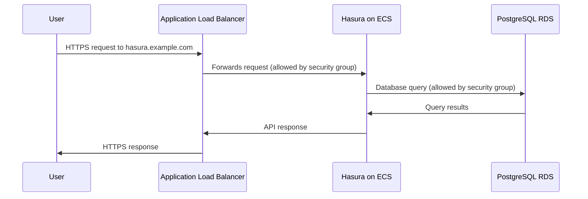

# Chapter 1: Networking & Access Control

Welcome to the first chapter of our Terraform AWS Hasura tutorial! Before diving into the technical details, let's understand what we're trying to accomplish.

## What is Networking & Access Control?

Imagine you're building a house in a gated community. You need:
- Roads to connect your house to the outside world
- A security gate to control who enters
- A mailbox with an address so people can find you

In the world of AWS and Hasura, networking and access control serve similar purposes:
- Roads → Network connections that allow data to flow
- Security gate → Security groups that control what traffic is allowed
- Mailbox/address → Domain names and load balancers that direct users to your service

## Why This Matters

When you deploy Hasura on AWS, you need to ensure:
1. Your API is accessible to intended users
2. Unauthorized users can't access your infrastructure
3. Traffic is properly routed to your Hasura service

Let's explore how to set this up with a simple example.

## Key Components

### 1. Virtual Private Cloud (VPC)

Think of a VPC as your private property in the AWS cloud - it's your own isolated network.

```terraform
module "hasura" {
  source  = "Rayraegah/hasura/aws"
  version = "3.X.Y"
  region  = "us-east-1"
  # VPC settings
  vpc_enable_dns_hostnames = true
  az_count                 = 2
}
```

This configures a VPC with DNS hostnames enabled (so services can find each other by name) and spanning 2 availability zones (for redundancy).

### 2. Domain Configuration

To make your Hasura API accessible via a user-friendly address:

```terraform
module "hasura" {
  # Previous configuration...
  domain            = "example.com"
  hasura_subdomain  = "hasura"
  app_subdomain     = "app"
}
```

This will make your Hasura API accessible at `hasura.example.com` and allow your application at `app.example.com` to communicate with it.

### 3. Security Groups

Security groups act as virtual firewalls, controlling traffic to and from your resources:

```terraform
# The module automatically creates security groups
# You can reference them in outputs:
output "ecs_security_group" {
  description = "Security group controlling access to the ECS tasks"
  value = aws_security_group.hasura_ecs
}
```

You can also specify additional security groups:

```terraform
module "hasura" {
  # Previous configuration...
  additional_db_security_groups = ["sg-123456"]
}
```

This allows you to grant access to your database from other AWS resources.

## How It Works Behind the Scenes

When you deploy Hasura using this Terraform module, here's what happens with the networking components:



The Terraform module creates:

1. A VPC with public and private subnets across availability zones
2. Security groups that allow only necessary traffic
3. An Application Load Balancer (ALB) in the public subnets
4. Route 53 DNS records pointing to the ALB
5. A TLS certificate for secure HTTPS communication

## Let's Look at a Practical Example

Imagine you're deploying a Hasura GraphQL API for a todo application:

```terraform
module "hasura" {
  source                   = "Rayraegah/hasura/aws"
  version                  = "3.X.Y"
  region                   = "us-east-1"
  domain                   = "mytodoapp.com"
  hasura_subdomain         = "api"
  app_subdomain            = "app"
  hasura_version_tag       = "v2.0.0"
  hasura_admin_secret      = "my-secure-admin-secret"
  # Network settings
  az_count                 = 2
  multi_az                 = true
  vpc_enable_dns_hostnames = true
}
```

With this configuration:
- Users will access your API at `https://api.mytodoapp.com`
- Your front-end application at `https://app.mytodoapp.com` can make CORS requests to the API
- The infrastructure is distributed across 2 availability zones for high availability
- Security groups automatically control traffic flow between components

## Advanced: Customizing Security Groups

While the module creates default security groups, you might need to allow additional access:

```terraform
resource "aws_security_group_rule" "allow_monitoring" {
  type              = "ingress"
  from_port         = 8080
  to_port           = 8080
  protocol          = "tcp"
  cidr_blocks       = ["10.0.0.0/16"]
  security_group_id = module.hasura.ecs_security_group.id
}
```

This example adds a rule to allow monitoring traffic on port 8080 from a specific network range.

## Conclusion

In this chapter, we've learned how networking and access control work in the `terraform-aws-hasura` module:

- VPCs provide isolated network environments
- Security groups control traffic between components
- Load balancers distribute traffic to your Hasura instances
- DNS configuration makes your API accessible via a user-friendly domain

With these components properly configured, your Hasura GraphQL Engine will be securely accessible to your users while protected from unauthorized access.

In the next chapter, we'll explore how to leverage [Multi-Availability Zone Architecture](02_multi_availability_zone_architecture_.md) to ensure your Hasura deployment remains available even when an AWS data center experiences issues.

---

Generated by [AI Codebase Knowledge Builder](https://github.com/The-Pocket/Tutorial-Codebase-Knowledge)