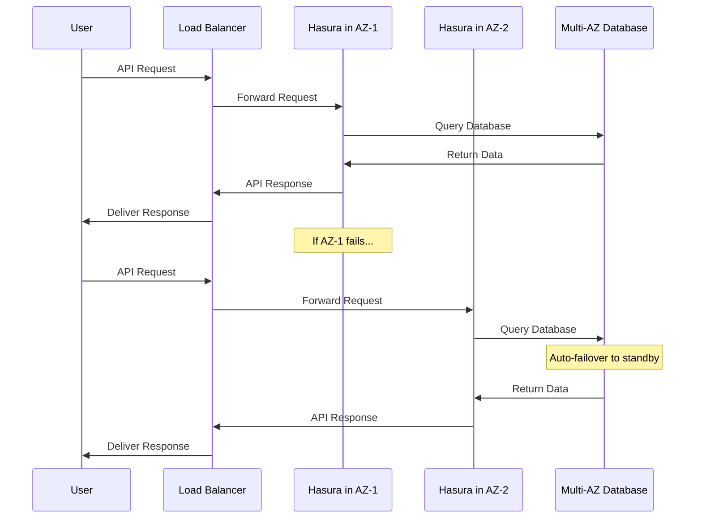

# Chapter 2: Multi-Availability Zone Architecture

In [Chapter 1: Networking & Access Control](01_networking___access_control_.md), we learned how to set up the networking foundation for our Hasura deployment on AWS. Now, let's explore how to make our Hasura deployment resilient against infrastructure failures using Multi-Availability Zone Architecture.

## What is Multi-Availability Zone Architecture?

Imagine you're running a restaurant. If your kitchen catches fire, you'd be out of business until repairs are complete. But what if you had two identical kitchens in different buildings? If one kitchen has a problem, you could immediately switch to the other one, and your customers would barely notice any disruption.

This is exactly what Multi-Availability Zone (Multi-AZ) architecture does for your cloud applications!

AWS divides each region (like us-east-1) into multiple isolated data centers called **Availability Zones**. These zones are physically separated but connected by high-speed links. If one zone experiences issues (power outage, natural disaster, hardware failure), the others continue to operate normally.

## Why Does This Matter?

Let's consider a simple scenario:

You've launched your application with Hasura GraphQL Engine to manage your API. Suddenly, the AWS data center hosting your application experiences a power outage. Without Multi-AZ architecture, your application would be completely down until AWS resolves the issue. Your users can't access your service, potentially costing you business and damaging your reputation.

With Multi-AZ architecture, your application continues running in other availability zones without interruption!

## Key Components of Multi-AZ Architecture

### 1. Distributing Compute Resources (ECS Tasks)

The module configures Hasura to run on Amazon's Elastic Container Service (ECS) across multiple availability zones:

```terraform
module "hasura" {
  source    = "Rayraegah/hasura/aws"
  version   = "3.X.Y"
  region    = "us-east-1"
  az_count  = 2
  multi_az  = true
}
```

This configuration deploys Hasura container instances across 2 availability zones. If one zone goes down, the other continues serving your API requests.

### 2. Redundant Database (RDS Multi-AZ)

A single database instance is a potential single point of failure. The module configures RDS (Relational Database Service) in Multi-AZ mode:

```terraform
module "hasura" {
  # Previous configuration...
  multi_az = true
  rds_instance = "db.t3.small"
}
```

With `multi_az = true`, AWS creates a primary database instance and a standby replica in a different availability zone. If the primary instance fails, AWS automatically promotes the standby replica to become the new primary.

### 3. Load Balancing Across Zones

The Application Load Balancer (ALB) distributes incoming traffic across all healthy Hasura instances:

```terraform
# The module automatically configures the ALB for multi-AZ
# when you set az_count > 1 and multi_az = true
```

If instances in one availability zone become unhealthy, the ALB automatically routes traffic only to healthy instances in other zones.

## How It All Works Together

When you deploy Hasura with Multi-AZ architecture, here's what happens behind the scenes:



This diagram shows how a request flows through the system. If an availability zone fails, the load balancer automatically routes traffic to healthy instances in other zones, and the database fails over to its standby replica.

## Practical Example: Setting Up Multi-AZ Architecture

Let's configure a resilient Hasura deployment with Multi-AZ architecture:

```terraform
module "hasura" {
  source                 = "Rayraegah/hasura/aws"
  version                = "3.X.Y"
  region                 = "us-east-1"
  domain                 = "example.com"
  hasura_subdomain       = "api"
  
  # Multi-AZ configuration
  az_count               = 3
  multi_az               = true
  
  # Database configuration
  rds_instance           = "db.t3.small"
  rds_db_name            = "hasuradb"
  rds_username           = "hasurauser"
  rds_password           = "securepassword"
  rds_storage_encrypted  = true
}
```

This configuration:
- Deploys Hasura across 3 availability zones
- Sets up a Multi-AZ RDS database instance
- Configures load balancing across all zones
- Enables encryption for database storage

## Monitoring Your Multi-AZ Deployment

After deployment, you'll want to monitor your infrastructure to ensure it's functioning correctly:

```terraform
output "load_balancer_dns" {
  value = module.hasura.alb_dns_name
}

output "hasura_url" {
  value = "https://${var.hasura_subdomain}.${var.domain}"
}
```

These outputs provide the DNS names you can use to access your Hasura API. The ALB automatically distributes traffic to healthy instances across all availability zones.

## Cost Considerations

Multi-AZ deployments provide significant benefits for reliability, but they do come with additional costs:

1. Running resources in multiple AZs means you're paying for more infrastructure
2. Multi-AZ RDS instances cost more than single-AZ instances
3. Data transfer between availability zones incurs charges

For production environments, these costs are usually justified by the increased reliability. For development or testing environments, you might consider using a single availability zone to reduce costs.

## Advanced: Customizing Multi-AZ Behavior

For more fine-grained control, you can customize aspects of the Multi-AZ deployment:

```terraform
module "hasura" {
  # Previous configuration...
  
  # Control the number of Hasura tasks
  min_capacity = 2
  max_capacity = 6
  
  # Configure CPU and memory for each task
  hasura_task_cpu       = 256
  hasura_task_memory    = 512
  hasura_container_cpu  = 128
  hasura_container_memory = 384
}
```

This configuration allows you to control how many instances of Hasura run simultaneously and how resources are allocated to each instance. The actual number of tasks will be distributed across your availability zones.

## Common Issues and Solutions

**Issue 1: Uneven load distribution**
- **Solution**: AWS automatically balances new deployments, but you can use weighted target groups for more control.

**Issue 2: Increased latency between zones**
- **Solution**: Ensure your database and application are in the same region to minimize latency.

**Issue 3: Higher costs than expected**
- **Solution**: Start with 2 AZs instead of 3, and use appropriate instance sizes for your workload.

## Conclusion

In this chapter, we've learned how Multi-Availability Zone Architecture provides resilience and high availability for your Hasura deployment on AWS:

- Distributing Hasura across multiple availability zones prevents downtime if one zone fails
- Multi-AZ RDS database ensures your data remains accessible even during infrastructure failures
- Load balancers automatically route traffic to healthy instances across all zones

By implementing Multi-AZ architecture, you've significantly improved the reliability of your Hasura GraphQL Engine deployment. Your users will enjoy consistent access to your API, even when AWS experiences localized infrastructure issues.

In the next chapter, [Database Configuration](03_database_configuration_.md), we'll explore how to properly configure and optimize your PostgreSQL database for Hasura, ensuring it's not only highly available but also properly tuned for your specific workload.

---

Generated by [AI Codebase Knowledge Builder](https://github.com/The-Pocket/Tutorial-Codebase-Knowledge)