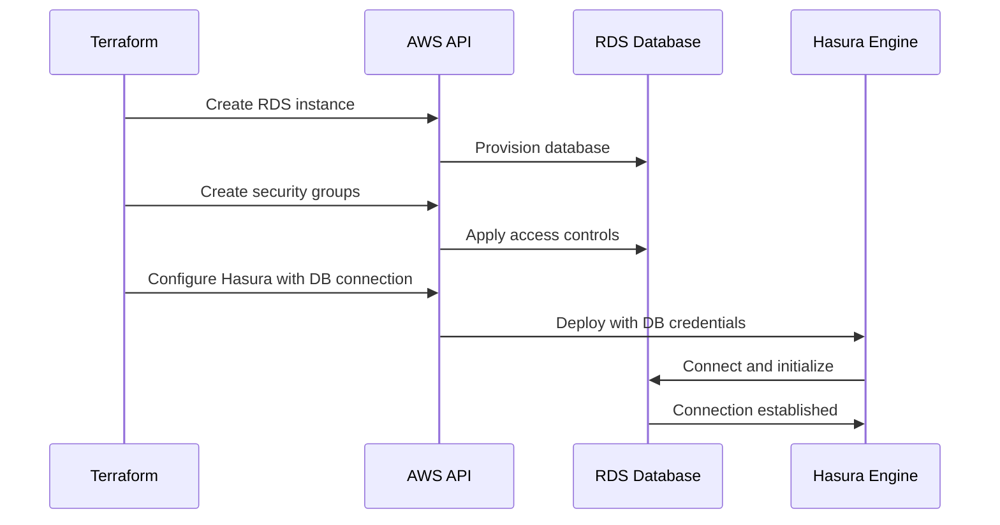

# Chapter 3: Database Configuration

In [Chapter 2: Multi-Availability Zone Architecture](02_multi_availability_zone_architecture_.md), we learned how to make our Hasura deployment resilient by spreading it across multiple AWS availability zones. Now, let's focus on the foundation of any data-driven application: the database.

## What is Database Configuration?

Imagine you're building a house. The database is like the foundation and structural framework - everything else depends on it being solid and reliable. In the `terraform-aws-hasura` module, database configuration is about setting up the PostgreSQL database that will store all the data your GraphQL API will serve.

## Why Does This Matter?

Let's say you're building a social media application with Hasura. Your users will create profiles, post updates, follow each other, and interact with content. All of this information needs to be stored somewhere secure, reliable, and fast - that's your database!

If your database is:
- Too small: Your application will slow down as user count grows
- Insecure: User data could be compromised
- Not properly configured: You might face unexpected downtime

## Key Components of Database Configuration

### 1. Choosing the Right Database Size

The module allows you to select an appropriate RDS instance type based on your needs:

```terraform
module "hasura" {
  source        = "Rayraegah/hasura/aws"
  version       = "3.X.Y"
  region        = "us-east-1"
  rds_instance  = "db.t3.small"
}
```

This configures a `db.t3.small` PostgreSQL instance, which is good for development or small production workloads. For larger applications, you might choose `db.t3.medium` or larger.

### 2. Setting Database Credentials

Secure credentials are essential for protecting your data:

```terraform
module "hasura" {
  # Previous configuration...
  rds_db_name    = "myappdb"
  rds_username   = "dbadmin"
  rds_password   = "your-secure-password"
}
```

These settings define the database name, username, and password. Make sure to use a strong, unique password and keep it secure!

### 3. Enabling Database Encryption

For sensitive data, encryption at rest is crucial:

```terraform
module "hasura" {
  # Previous configuration...
  rds_storage_encrypted = true
}
```

Setting `rds_storage_encrypted` to `true` ensures that all your database data is encrypted on disk, adding an extra layer of security.

### 4. Configuring Database Access

The module automatically sets up security groups to control who can access your database:

```terraform
module "hasura" {
  # Previous configuration...
  additional_db_security_groups = ["sg-12345", "sg-67890"]
}
```

This optional setting allows you to specify additional security groups that should have access to your database, such as for analytics tools or database management applications.

## How It All Works Together

When you deploy Hasura with database configuration, here's what happens behind the scenes:



The module creates:

1. An RDS PostgreSQL instance with your specified settings
2. A master user with the credentials you provided
3. Security groups that allow only Hasura to connect to the database
4. Automatic backups based on AWS RDS defaults

## Practical Example: Setting Up a Database for a Todo App

Let's configure a database for a simple todo application:

```terraform
module "hasura" {
  source                = "Rayraegah/hasura/aws"
  version               = "3.X.Y"
  region                = "us-east-1"
  domain                = "mytodoapp.com"
  hasura_subdomain      = "api"
  
  # Database configuration
  rds_instance          = "db.t3.small"
  rds_db_name           = "todos"
  rds_username          = "todoadmin"
  rds_password          = "very-secure-password"
  rds_storage_encrypted = true
  
  # High availability settings
  multi_az              = true
  az_count              = 2
}
```

This configuration:
- Creates a PostgreSQL database named "todos"
- Sets up credentials for database access
- Enables encryption for sensitive user data
- Configures the database for high availability across 2 availability zones

## Advanced: Database Performance and Scaling

As your application grows, you might need to adjust your database configuration:

```terraform
module "hasura" {
  # Previous configuration...
  rds_instance          = "db.r5.large"
  rds_engine_version    = "14.4"
  rds_param_group       = "postgres14"
}
```

This example upgrades to a memory-optimized instance type (`r5.large`) for better performance and specifies PostgreSQL version 14.4 with the corresponding parameter group.

## Understanding Database Backups

AWS RDS automatically takes daily backups of your database and keeps them for a retention period. These backups allow you to restore your database to a specific point in time if something goes wrong.

The default backup retention period is 7 days, but you can customize this if needed (though this isn't directly exposed in the module parameters).

## Connecting Other Services to Your Database

Sometimes you need other services, like data migration tools or analytics platforms, to access your database. The module allows this through additional security groups:

```terraform
# First, create a security group for your analytics service
resource "aws_security_group" "analytics_sg" {
  name        = "analytics-sg"
  description = "Security group for analytics service"
  vpc_id      = module.hasura.vpc_id
  
  # Add necessary rules
}

# Then reference it in the Hasura module
module "hasura" {
  # Previous configuration...
  additional_db_security_groups = [aws_security_group.analytics_sg.id]
}
```

This allows your analytics service, protected by the security group, to connect to the RDS database.

## Monitoring Your Database

After deployment, you'll want to monitor your database performance:

```terraform
output "db_instance_id" {
  value = module.hasura.rds_instance_id
}
```

This output provides the RDS instance ID, which you can use to set up CloudWatch alarms or find the instance in the AWS console for monitoring.

AWS automatically collects metrics like CPU utilization, memory usage, disk space, and IOPS, which you can view in the CloudWatch dashboard.

## Common Issues and Solutions

**Issue 1: Database connection timeouts**
- **Solution**: Check security groups to ensure proper access between Hasura and RDS.

**Issue 2: Database running out of storage**
- **Solution**: Monitor disk usage and increase allocated storage before it fills up.

**Issue 3: Slow query performance**
- **Solution**: Consider upgrading to a larger instance type or optimizing your database schema.

## Conclusion

In this chapter, we've learned how to configure the PostgreSQL database that powers your Hasura GraphQL Engine:

- Selecting an appropriate database instance size for your workload
- Setting secure credentials and enabling encryption
- Configuring high availability with Multi-AZ deployment
- Controlling access through security groups
- Monitoring and scaling your database as your application grows

With a properly configured database, your Hasura application has a solid foundation for storing and retrieving data efficiently and securely. The database is the backbone of your application, silently supporting all the GraphQL operations that make your API powerful.

In the next chapter, [Security & Authentication](04_security___authentication_.md), we'll explore how to secure your Hasura GraphQL API with authentication and authorization, ensuring that users can only access the data they're supposed to.

---

Generated by [AI Codebase Knowledge Builder](https://github.com/The-Pocket/Tutorial-Codebase-Knowledge)