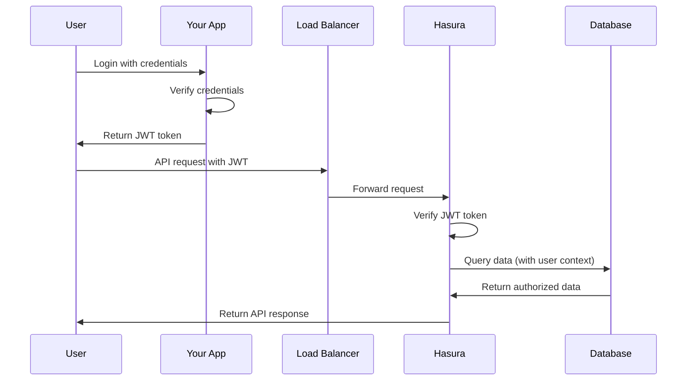

# Chapter 4: Security & Authentication

In [Chapter 3: Database Configuration](03_database_configuration_.md), we set up the foundation for our data storage. Now let's focus on keeping that data secure by implementing proper security and authentication for our Hasura deployment.

## What is Security & Authentication?

Imagine you're hosting an exclusive party. You need:
- A bouncer at the door checking IDs (authentication)
- VIP wristbands for different access levels (authorization)
- Security personnel monitoring who goes where (security groups)

In the AWS Hasura world, security and authentication serve similar purposes:
- Authentication verifies who users are
- Authorization determines what they can access
- Security groups control which services can communicate with each other

## Why This Matters

Let's consider a practical example:

You're building a todo application where users can create and manage their personal tasks. You need to ensure:
1. Only registered users can access the application
2. Users can only see and modify their own tasks
3. Your admin team can access everything for support purposes
4. No unauthorized services can access your database

Without proper security measures, anyone could potentially access all the tasks in your database!

## Key Components

### 1. Hasura Admin Secret

The admin secret is like a master key for your Hasura GraphQL Engine. Anyone with this key has full control over your API and database.

```terraform
module "hasura" {
  source              = "Rayraegah/hasura/aws"
  version             = "3.X.Y"
  hasura_admin_secret = "your-secure-admin-secret"
}
```

This configures a secret password that must be provided to access admin-level functions. Always use a strong, unique password here!

### 2. JWT Authentication

JWT (JSON Web Tokens) allows secure authentication of users. When a user logs in through your authentication system, they receive a token that Hasura can verify.

```terraform
module "hasura" {
  # Previous configuration...
  hasura_jwt_secret_algo = "HS256"
  hasura_jwt_secret_key  = "your-jwt-secret-key"
}
```

This tells Hasura to verify JWT tokens using the HMAC SHA-256 algorithm and the provided secret key. When a user makes a request with their JWT, Hasura can identify who they are and what they're allowed to access.

### 3. Network Security Groups

Security groups act as virtual firewalls that control traffic between your AWS resources:

```terraform
module "hasura" {
  # Previous configuration...
  additional_db_security_groups = ["sg-12345"]
}
```

This allows you to specify which other AWS resources (identified by their security groups) can access your database, adding an extra layer of protection.

## How It All Works Together

When you secure your Hasura deployment, here's what happens behind the scenes:



The system:
1. Authenticates users through your auth system
2. Issues JWT tokens containing user information
3. Verifies these tokens on each request
4. Uses the token's claims to determine what data the user can access
5. Ensures only authorized services can communicate with each other

## Let's Build a Secure Todo App

Let's configure security for our todo application:

```terraform
module "hasura" {
  source                = "Rayraegah/hasura/aws"
  version               = "3.X.Y"
  region                = "us-east-1"
  domain                = "mytodoapp.com"
  hasura_subdomain      = "api"
  
  # Security configuration
  hasura_admin_secret   = "very-strong-admin-password"
  hasura_jwt_secret_algo = "HS256"
  hasura_jwt_secret_key = "your-jwt-signing-secret-key"
}
```

With this configuration:
- Your admin console is protected by a strong password
- User requests must include valid JWT tokens
- Only authorized services can access your database

## Setting Up JWT Authentication

For JWT authentication to work, you need to set up a compatible authentication system. Here's a simple example of how a JWT token for Hasura might look:

```json
{
  "sub": "user-123",
  "name": "John Doe",
  "admin": false,
  "iat": 1516239022,
  "https://hasura.io/jwt/claims": {
    "x-hasura-allowed-roles": ["user"],
    "x-hasura-default-role": "user",
    "x-hasura-user-id": "user-123"
  }
}
```

The special `https://hasura.io/jwt/claims` section tells Hasura:
- This user can act in the "user" role
- By default, they should use the "user" role
- Their user ID is "user-123"

When Hasura receives a request with this token, it can apply row-level security policies based on the user's ID.

## Advanced: Row-Level Security

Once authentication is in place, you can implement row-level security in Hasura to control what data each user can access:

```sql
-- This would be done in Hasura Console after deployment
CREATE POLICY "Users can only see their own todos" 
  ON todos FOR SELECT 
  USING (user_id = current_setting('hasura.user')::text);
```

This PostgreSQL policy ensures users can only access todos where the `user_id` matches their own ID, which comes from the JWT token.

## Monitoring Authentication Activity

For security purposes, you might want to monitor authentication activity:

```terraform
# The module automatically logs activity to CloudWatch
# You can view these logs in the AWS Console
```

Hasura logs authentication events, making it possible to audit access and detect unusual patterns that might indicate security issues.

## Best Practices for Secure Deployment

1. **Use strong, unique passwords** for your admin secret
2. **Rotate JWT keys** periodically for enhanced security
3. **Enable TLS** (the module does this automatically)
4. **Implement row-level security** in your database
5. **Monitor logs** for suspicious activity

## Common Issues and Solutions

**Issue 1: "JWT invalid" errors**
- **Solution**: Ensure your JWT is properly signed and includes the correct Hasura claims structure

**Issue 2: Users accessing data they shouldn't**
- **Solution**: Implement proper row-level security policies in your database

**Issue 3: Admin console exposed to the public**
- **Solution**: Use a strong admin secret and consider restricting access using security groups

## Conclusion

In this chapter, we've explored how to secure your Hasura GraphQL Engine deployment on AWS:

- Setting up an admin secret to protect administrative functions
- Configuring JWT authentication to identify users securely
- Using security groups to control network traffic between components
- Implementing row-level security to ensure users only access their data

With these security measures in place, your Hasura deployment is protected from unauthorized access, and users can safely interact with only the data they're permitted to see.

In the next chapter, [Hasura GraphQL Engine Deployment](05_hasura_graphql_engine_deployment_.md), we'll explore how to actually deploy and configure the Hasura GraphQL Engine to bring your API to life.

---

Generated by [AI Codebase Knowledge Builder](https://github.com/The-Pocket/Tutorial-Codebase-Knowledge)