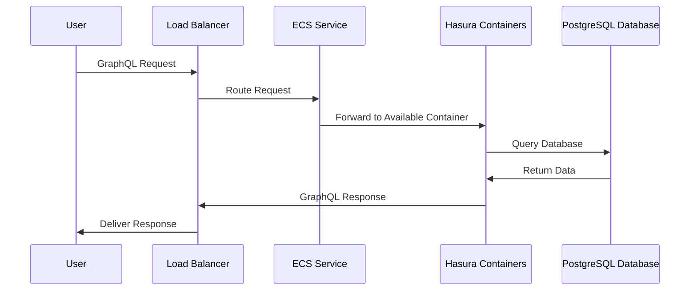

# Chapter 5: Hasura GraphQL Engine Deployment

In [Chapter 4: Security & Authentication](04_security___authentication_.md), we established how to secure our Hasura instance. Now let's explore how to actually deploy the Hasura GraphQL Engine to AWS.

## What is Hasura GraphQL Engine Deployment?

Imagine you're opening a restaurant chain with multiple locations across a city. You need to:
- Find suitable buildings in different neighborhoods (availability zones)
- Set up identical kitchens with the same menu (Hasura service)
- Ensure customers can find and visit any location easily (load balancers)
- Make sure one location can handle overflow if another gets too busy (scaling)

In AWS terms, deploying the Hasura GraphQL Engine means setting up containers that run Hasura across multiple availability zones, connecting them to your database, and making them accessible through a load balancer.

## Why This Matters

Let's say you're building a social media application. Your users need to access their profiles, post updates, and interact with each other at any time, from anywhere. If your service is slow or unavailable, they'll quickly abandon your platform.

With a proper deployment:
- Users experience fast response times regardless of where they are
- Your service stays online even if part of AWS has an outage
- Your application can handle sudden spikes in traffic

## Key Components

### 1. Hasura Container Setup

The heart of your deployment is the Hasura container itself:

```terraform
module "hasura" {
  source             = "Rayraegah/hasura/aws"
  version            = "3.X.Y"
  hasura_version_tag = "v2.0.0"
  region             = "us-east-1"
}
```

This configures which version of Hasura will run in your deployment. The module automatically pulls the specified version from Docker Hub and sets it up to run in AWS.

### 2. Compute Resources

You need to specify how much CPU and memory your Hasura instance needs:

```terraform
module "hasura" {
  # Previous configuration...
  hasura_task_cpu       = 256
  hasura_task_memory    = 512
  hasura_container_cpu  = 128
  hasura_container_memory = 384
}
```

These settings allocate resources to your Hasura container. Think of them as determining how powerful each "kitchen" in your restaurant chain will be.

### 3. Scaling Configuration

To handle varying loads, you can configure auto-scaling:

```terraform
module "hasura" {
  # Previous configuration...
  min_capacity = 2
  max_capacity = 6
}
```

This tells AWS to run at least 2 Hasura instances at all times, but to automatically add more (up to 6) when traffic increases, and remove them when traffic decreases.

### 4. Environment Variables

Hasura needs configuration through environment variables:

```terraform
module "hasura" {
  # Previous configuration...
  environment = [
    { name = "HASURA_GRAPHQL_CORS_DOMAIN", value = "*" },
    { name = "HASURA_GRAPHQL_DEV_MODE", value = "false" }
  ]
}
```

These environment variables customize Hasura's behavior. For example, here we're configuring CORS settings and disabling development mode.

## How It All Works Together

When you deploy Hasura using this Terraform module, here's what happens behind the scenes:



1. The module creates an ECS (Elastic Container Service) cluster
2. It deploys Hasura containers across multiple availability zones
3. It sets up a load balancer to distribute traffic to the containers
4. It configures auto-scaling based on traffic patterns
5. Each container connects to your PostgreSQL database

## Building a Complete Deployment

Let's put everything together for our social media application:

```terraform
module "hasura" {
  source                 = "Rayraegah/hasura/aws"
  version                = "3.X.Y"
  region                 = "us-east-1"
  domain                 = "mysocialapp.com"
  hasura_subdomain       = "api"
  
  # Hasura configuration
  hasura_version_tag     = "v2.0.0"
  hasura_admin_secret    = "my-secure-admin-secret"
  hasura_console_enabled = "true"
  
  # Deployment settings
  az_count               = 3
  multi_az               = true
  min_capacity           = 2
  max_capacity           = 10
  
  # Resource allocation
  hasura_task_cpu        = 512
  hasura_task_memory     = 1024
}
```

With this configuration:
- Your Hasura API will be available at `https://api.mysocialapp.com`
- It will be deployed across 3 availability zones for high availability
- It will automatically scale between 2 and 10 instances based on load
- Each instance will have sufficient resources to handle your application's needs

## Monitoring Your Deployment

After deployment, you'll want to monitor your Hasura instances:

```terraform
output "cloudwatch_log_group" {
  value = module.hasura.cloudwatch_log_group
}
```

This output provides the CloudWatch log group where you can monitor your Hasura instances. AWS automatically collects logs from your containers, allowing you to troubleshoot issues and monitor performance.

## Advanced: Custom Environment Configuration

You can customize Hasura's behavior extensively through environment variables:

```terraform
locals {
  hasura_env = [
    { name = "HASURA_GRAPHQL_ENABLE_CONSOLE", value = "true" },
    { name = "HASURA_GRAPHQL_CORS_DOMAIN", value = "https://app.mysocialapp.com" },
    { name = "HASURA_GRAPHQL_PG_CONNECTIONS", value = "50" }
  ]
}

module "hasura" {
  # Previous configuration...
  environment = local.hasura_env
}
```

This example:
- Enables the Hasura console for administration
- Sets CORS to allow requests only from your frontend application
- Configures database connection pooling for better performance

## Deployment Best Practices

1. **Start small, then scale**: Begin with `min_capacity = 2` and a modest instance size, then increase based on actual usage.

2. **Monitor and adjust**: Watch your CloudWatch metrics to understand your application's performance and adjust resources accordingly.

3. **Use appropriate regions**: Deploy in AWS regions close to your users for better performance.

4. **Version pinning**: Always specify an exact Hasura version to avoid unexpected changes during redeployments.

5. **Environment-specific configs**: Use different configurations for development, staging, and production environments.

## Common Issues and Solutions

**Issue 1: Deployment fails with resource constraints**
- **Solution**: Check that your requested CPU and memory are available in the selected AWS region and instance type.

**Issue 2: Hasura containers keep restarting**
- **Solution**: Check the CloudWatch logs for errors, and verify that your container has enough memory.

**Issue 3: High latency for some users**
- **Solution**: Consider deploying in multiple AWS regions closer to your users.

## Conclusion

In this chapter, we've learned how to deploy the Hasura GraphQL Engine on AWS:

- Setting up Hasura containers with the right version and configuration
- Allocating appropriate compute resources
- Configuring auto-scaling to handle varying loads
- Distributing the deployment across multiple availability zones for reliability
- Monitoring your deployment through CloudWatch logs

With your Hasura GraphQL Engine properly deployed, you now have a scalable, resilient API that can serve your application's data needs reliably. Your users will enjoy fast response times, and your service will remain available even during partial AWS outages.

This completes our tutorial on deploying Hasura on AWS using Terraform. You now have the knowledge to set up a production-ready GraphQL API that's secure, scalable, and highly available. As your application grows, you can revisit earlier chapters to fine-tune specific aspects of your deployment.

The journey doesn't end here - as your application evolves, you'll want to explore more advanced features like custom business logic with Actions, real-time subscriptions, and remote schemas. The foundation we've built together provides a solid platform for these future enhancements.

---

Generated by [AI Codebase Knowledge Builder](https://github.com/The-Pocket/Tutorial-Codebase-Knowledge)