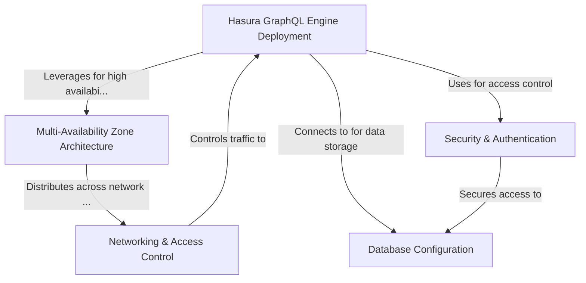

# Tutorial: terraform-aws-hasura

The `terraform-aws-hasura` project is a Terraform module for deploying **Hasura GraphQL Engine** on AWS with high availability. It sets up a complete infrastructure including a *PostgreSQL database* in RDS, Hasura running in ECS Fargate, and load balancers to distribute traffic. The module emphasizes **reliability** through multi-availability zone deployment and **security** with features like database encryption, JWT authentication, and proper network access controls. It's designed to give developers an easy way to deploy a production-ready GraphQL API service with minimal configuration.

**Source Repository:** [None](None)

## Chapters

1. [Networking & Access Control
](01_networking___access_control_.md)
2. [Multi-Availability Zone Architecture
](02_multi_availability_zone_architecture_.md)
3. [Database Configuration
](03_database_configuration_.md)
4. [Security & Authentication
](04_security___authentication_.md)
5. [Hasura GraphQL Engine Deployment
](05_hasura_graphql_engine_deployment_.md)

---

Generated by [AI Codebase Knowledge Builder](https://github.com/The-Pocket/Tutorial-Codebase-Knowledge)